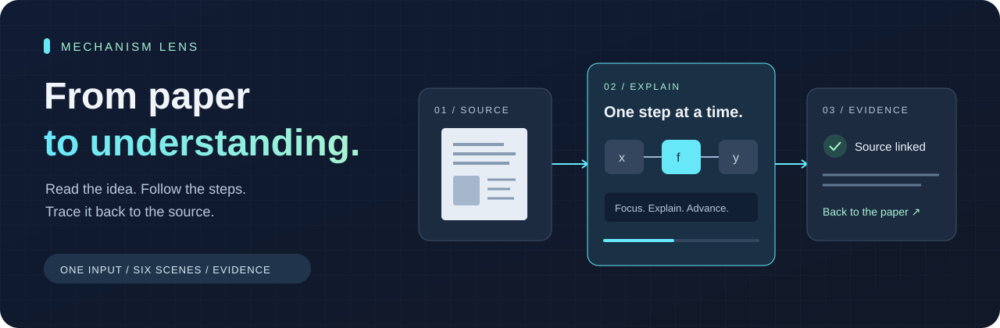
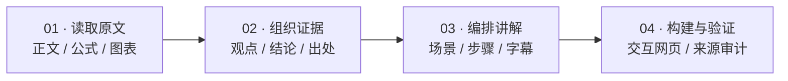

<p align="center">
  
</p>

<h1 align="center">Paper Explainer</h1>
<p align="center"><strong>把复杂论文，变成看得懂、点得动、查得到出处的视觉讲解。</strong></p>
<p align="center">一个自包含的 Agent Skill · 输入链接或文件 · 交付交互式网页</p>

<p align="center">
  <a href="LICENSE"></a>
  <a href="skills/paper-explainer/SKILL.md"></a>
  <a href="#quick-start"></a>
</p>

<p align="center">
  <a href="#experience">你会得到什么</a> ·
  <a href="#quick-start">快速开始</a> ·
  <a href="#scenes">六种讲解场景</a> ·
  <a href="#delivery">交付与分享</a> ·
  <a href="#development">开发文档</a>
</p>

---

读论文时，最难的往往是把公式、架构图和实验结果连起来。Paper Explainer 让 Agent 读取原文，把关键内容组织成可以逐步探索的讲解：看数据如何流动，拆开一个公式，跟踪一次算法执行，再点开对应的原文依据。

在支持本地 Skill 的 Agent 对话中输入：

```text
paper-explainer https://arxiv.org/abs/1706.03762
```

**从原文解析到网页构建，一次调用完成。** 支持 arXiv、DOI、PDF、网页、本地 PDF 和粘贴文本。以学术论文为主要场景，也可以输入技术报告等文档；讲解深度取决于原文可提取的信息。

<a id="experience"></a>
## 你会得到什么

| 读懂内容 | 掌握节奏 | 核对依据 |
| :--- | :--- | :--- |
| 用架构、公式、算法和图表解释技术细节 | 手动前后切换，或开启自动播放 | 从当前步骤打开「论文依据」 |
| 一步聚焦一个逻辑动作 | 字幕跟随当前步骤变化 | 查看摘录，跳转原网页或 PDF 页 |
| 将实验对比与对应结论放在一起 | 按章节浏览，回看难点 | 区分原文直接陈述与推导性解读 |

适合个人精读、读书会、组会分享，以及需要反复核对来源的技术讲解。网页、内容数据和可编辑源码一起交付，后续可以继续让 Agent 修改。

> **默认交付网页。** 明确要求「MP4 / 视频 / 录屏」时，才在内容定稿后安排视频导出；需要额外的录屏环境与 ffmpeg。

<a id="quick-start"></a>
## 快速开始

### 1. 安装 Skill

准备一个能读取本地 Skill、执行命令的 Agent，以及 **Node.js ≥ 18 和 npm**。运行时、六类场景和校验器随仓库提供，无需安装其它 Skill。构建时会安装 npm 依赖；使用附带的 `.sh` 工具需要 Bash，Windows 可使用 Git Bash 或 WSL。

先克隆仓库：

```bash
git clone https://github.com/EclidFundgue/paper-explainer.git
```

将 `skills/paper-explainer` 整个目录复制到你的 Agent 的 Skill 目录。以下按平台选择一种：

<details open>
<summary><strong>macOS / Linux / Git Bash</strong></summary>

```bash
# Claude Code
mkdir -p ~/.claude/skills
cp -r paper-explainer/skills/paper-explainer ~/.claude/skills/

# 使用 ~/.agents/skills 的 Agent（如 Codex）
mkdir -p ~/.agents/skills
cp -r paper-explainer/skills/paper-explainer ~/.agents/skills/
```

</details>

<details>
<summary><strong>Windows PowerShell</strong></summary>

```powershell
# 使用 ~/.agents/skills 的 Agent（如 Codex）
$skillDir = Join-Path $HOME '.agents/skills'
New-Item -ItemType Directory -Force -Path $skillDir | Out-Null
Copy-Item -Recurse -Path './paper-explainer/skills/paper-explainer' -Destination $skillDir
```

Claude Code 用户将目标目录改为 `.claude/skills`。以上命令用于首次安装；更新时同步整个 Skill 目录，避免保留旧版本文件。

</details>

### 2. 给它一份原文

安装后，在 Agent 的新会话里使用以下任一提示。**这些是对话提示，不是终端命令。**

```text
paper-explainer https://arxiv.org/abs/1706.03762
```

```text
用 paper-explainer 讲解 ./technical-report.pdf
```

```text
用 paper-explainer 讲解这篇论文，内容定稿后再导出 MP4：<论文链接>
```

不必先指定主题、篇幅、场景或输出目录。输入需要登录或无法解析时，Agent 会请求可访问的文件或正文。

### 3. 打开讲解

在生成的 `<paper-slug>-explainer/` 目录中：

| 系统 | 打开方式 |
| :--- | :--- |
| Windows | 双击 `open.cmd` |
| macOS | 双击 `open.command` |
| Linux | 运行 `bash open.sh` |

启动器会选择空闲端口并打开浏览器。查看已构建的网页需要 Node.js 或 Python；不需要运行开发服务器。

<a id="scenes"></a>
## 六种场景，把技术讲清楚

| 场景 | 适合解释 | 你可以看到 |
| :--- | :--- | :--- |
| **概念讲解** | 问题、前置知识、贡献与结论 | 围绕当前步骤聚焦关键概念 |
| **架构执行** | 模型模块、数据流、训练与推理管线 | 模块与连接随步骤高亮 |
| **公式拆解** | 核心公式、符号含义、数学关系 | LaTeX 公式与当前解释对应 |
| **算法跟踪** | 伪代码、循环、状态更新 | 当前代码行与状态逐步变化 |
| **实验对比** | 主结果、baseline、消融实验 | 指标与比较对象随步骤聚焦 |
| **原图检视** | 架构原图、定性结果、复杂图表 | 原图区域标注、局部放大与解读 |

Agent 根据原文选择场景。每个关键结论、数字和公式解释都要求绑定来源；基于原文的推导性解读单独标记，交付前生成来源审计报告。

## 从一份原文到一场讲解



播放器、字幕和来源面板共用同一份步骤数据。修改讲解时，先调整内容和来源，再重新构建网页，保证画面与说明一致。完整执行规范见 [SKILL.md](skills/paper-explainer/SKILL.md)。

<a id="delivery"></a>
## 交付的是一个可以带走的项目

```text
<paper-slug>-explainer/
├── open.cmd / open.command / open.sh  # 本地打开入口
├── site/                             # 构建好的静态网页
├── content/                          # 原文、结构化内容与讲解稿
├── project/                          # 可编辑的 React / TypeScript 源码
├── runtime/                          # 本地查看器与数据校验器
├── schemas/                          # 内容数据格式
└── reports/explanation-audit.md       # 来源覆盖与验证记录
```

分享给他人时，可以打包整个输出目录，通过启动脚本打开；也可以将 `site/` 部署到静态网站托管服务。网页所需的素材随构建产物提供，跳转外部原文时仍需联网。

<details>
<summary><strong>常见问题</strong></summary>

**这是一个独立聊天应用吗？**

它是供 Agent 使用的 Skill。Agent 负责阅读与编排内容，附带的运行时负责呈现讲解。

**只能处理论文吗？**

主要针对论文设计，也接受技术文档、网页或正文。公式、实验、图表等场景需要原文提供相应材料。

**需要配置其它设计或演示 Skill 吗？**

不需要。页面模板、场景渲染器、字幕、来源面板和启动器都已内置。

**扫描 PDF 或受限链接怎么办？**

提供可提取文本的 PDF、可访问链接或直接粘贴正文。PDF 文本提取可使用 Poppler 或 PyMuPDF；扫描件可能需要额外 OCR。

**能自动保证讲解没有错误吗？**

数据校验会检查结构与引用，来源审计帮助复核关键结论；内容准确性仍需结合原文检查，尤其是推导性解读。

</details>

<a id="development"></a>
## 开发与深入阅读

| 文档 | 内容 |
| :--- | :--- |
| [执行规范](skills/paper-explainer/SKILL.md) | 输入约定、生成流程与交付要求 |
| [环境与初始化](skills/paper-explainer/references/INIT.md) | 依赖、配置与项目脚手架 |
| [论文内容模型](skills/paper-explainer/references/PAPER-IR.md) | 事实、结论和证据组织 |
| [场景与步骤](skills/paper-explainer/references/SCENE-IR.md) | 六类场景的数据结构 |
| [运行时与交付](skills/paper-explainer/references/RUNTIME-AND-DELIVERY.md) | 构建、验证与打开方式 |
| [修改已有讲解](skills/paper-explainer/references/REVISION.md) | 内容更新与重新构建 |
| [开发与测试](skills/paper-explainer/references/DEVELOPMENT.md) | 渲染器、校验器与回归测试 |

<details>
<summary><strong>本地开发：创建并构建示例项目</strong></summary>

在仓库根目录执行；`demo-explainer` 必须不存在或为空：

```bash
node skills/paper-explainer/scripts/scaffold-project.mjs ./demo-explainer --title "Demo paper" --source "https://example.com/paper.pdf"
node skills/paper-explainer/scripts/build-project.mjs ./demo-explainer
```

脚手架包含演示数据，以上命令用于验证运行时，不会自动读取示例 URL 并生成真实论文讲解。正式内容由 Agent 按 Skill 流程写入。

运行时源码位于 [`assets/project-template/`](skills/paper-explainer/assets/project-template/)。欢迎通过 [Issues](https://github.com/EclidFundgue/paper-explainer/issues) 提交问题和改进建议。

</details>

---

<p align="center"><strong>让每一步讲解，都有原文可循。</strong><br/><a href="LICENSE">MIT License</a></p>
